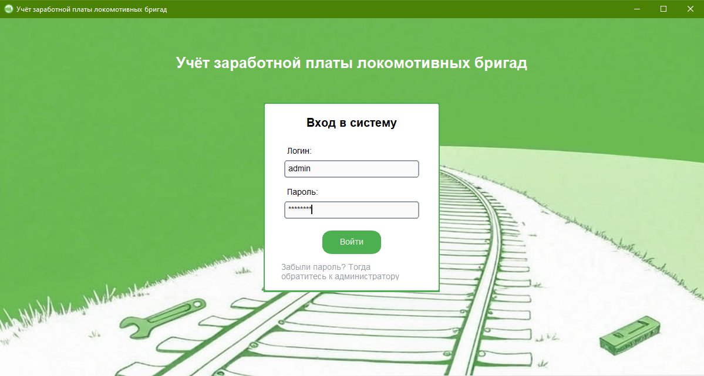
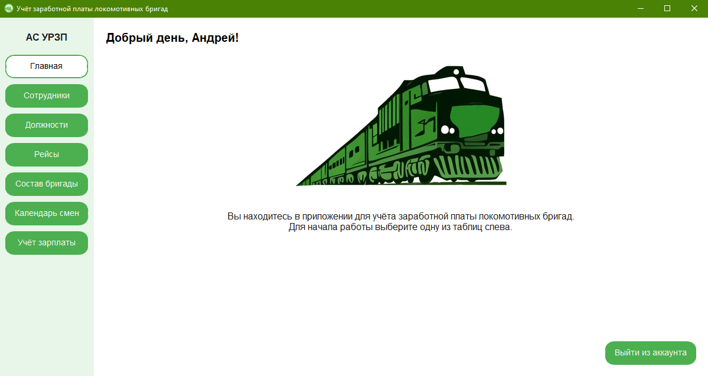
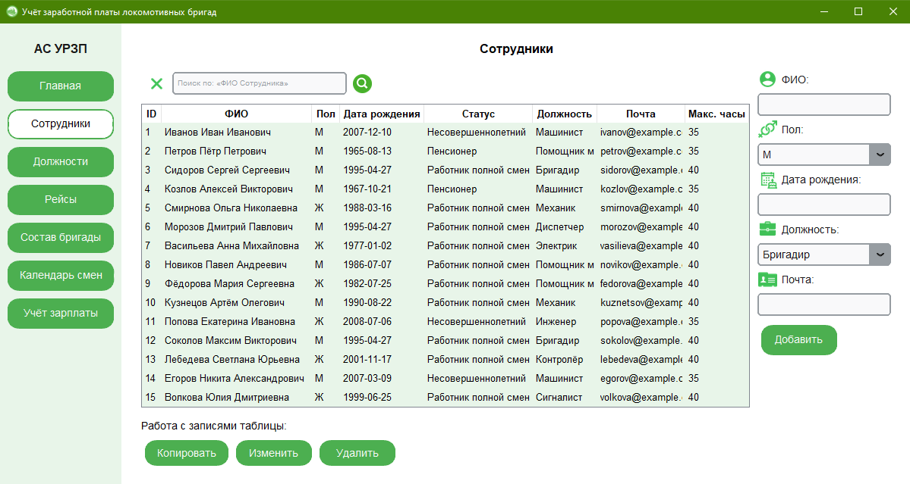
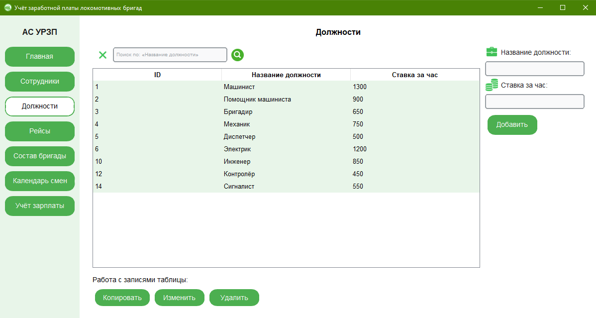
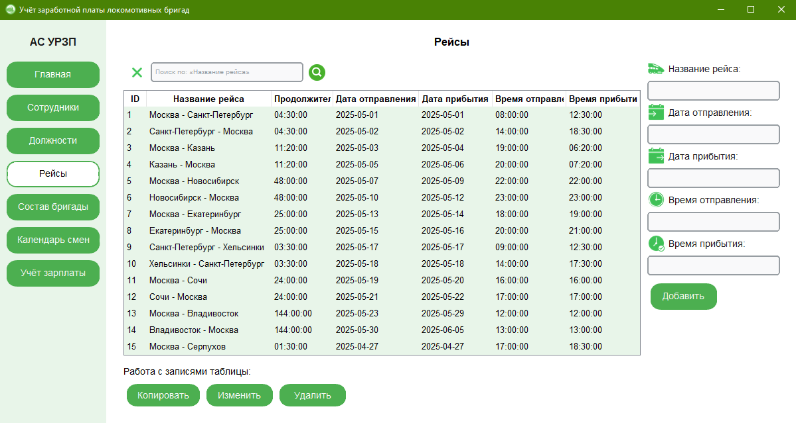
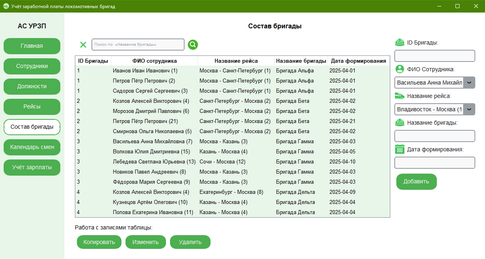
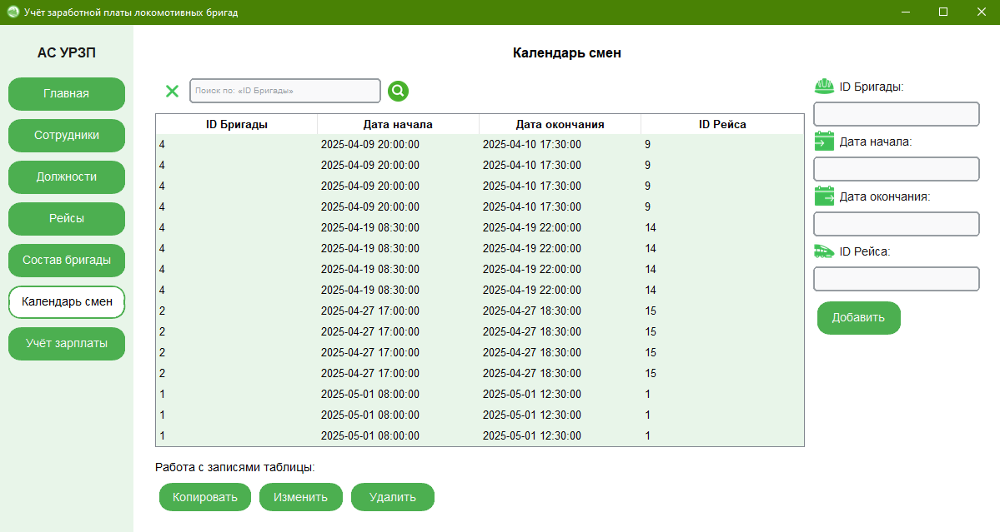
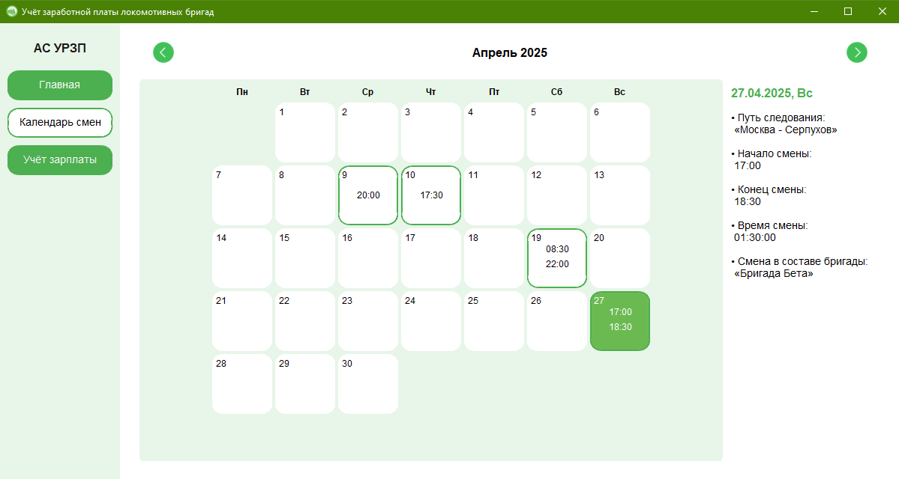
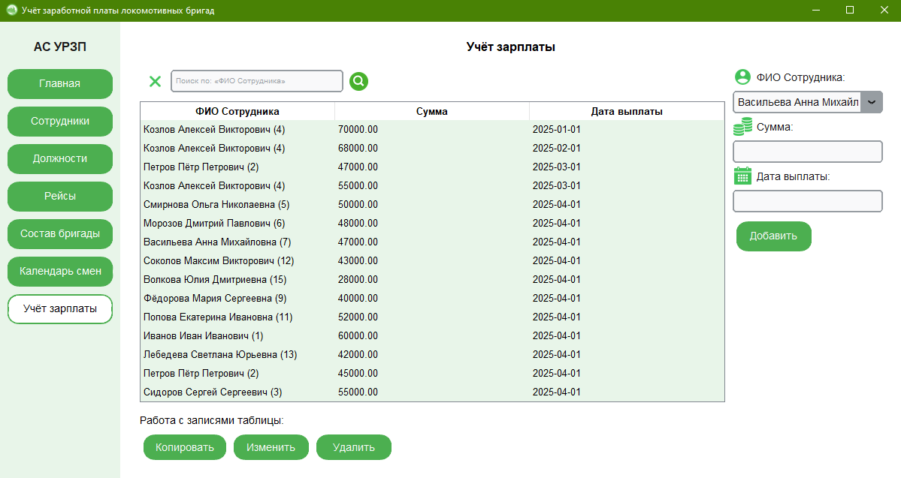

# Приложения для учёта заработной платы локомотивных бригад


**Brigades Salary Manager** — это **учебный** проект, разработанный для управления персоналом и учёта зарплаты для железнодорожной компании. Приложение позволяет управлять данными сотрудников, рейсов, состава бригад, календаря смен и расчёта выплат с использованием базы данных `PostgreSQL`. Графический интерфейс реализован с помощью `customtkinter` для удобного взаимодействия с данными и управления ролями пользователей.


## Цели проекта

1. **Управление данными**: Создать систему для управления сотрудниками, рейсами, составами бригад, графиками смен и учёта зарплаты для сотрудников локомотивных бригад;
2. **Приложение**: Разработать графическое приложение для добавления, редактирования, копирования, удаления записей и управления доступом на основе ролей пользователей.


## Возможности

- Управление данными сотрудников, должностей, рейсов, состава бригад, календаря смен и учёта зарплаты с использованием PostgreSQL.  
- Графический интерфейс на `customtkinter` с поддержкой:  
  - Авторизации пользователей с определением роли (Администратор, HR, Бухгалтер, Сотрудник); 
  - Добавления, редактирования, копирования и удаления записей в справочниках;
  - Поиска и фильтрации данных в таблицах;  
  - Графического отображения календаря смен для роли «Сотрудник»;
  - Ограничения доступа в зависимости от роли пользователя. 
- Поддержка ролей пользователей:  
  - **Администратор**: полный доступ ко всем функциям; 
  - **HR**: управление сотрудниками, должностями, бригадами и сменами;
  - **Бухгалтер**: учёт зарплаты и просмотр сотрудников;  
  - **Сотрудник**: просмотр своего графика смен и зарплаты.


## Структура проекта

- **`main.py`**: основной код приложения;
- **`config.py`**: конфигурационные параметры для подключения к базе данных;

- **`src/`**:  
  - `data/`:  
    - `last_login.json`: файл с последним введённым логином и паролем для быстрого входа.  
  - `assets/`:  
    - Иконки для полей ввода и фоновые изображения.  

- **`requirements.txt`**: зависимости для приложения;
- **`.gitignore`**: файл для исключения ненужных файлов;
- **`LICENSE`**: лицензия проекта — GNU General Public License 3.0 (GPL-3.0).  


## Исходные данные

### База данных
- База данных PostgreSQL `SalaryAccounting` хранит данные о сотрудниках, должностях, рейсах, бригадах, сменах и зарплате;  
- Дамп базы данных доступен в файле `src/data/salary_accounting_dump.sql`.  


## Установка и запуск

### Требования
- Python 3.11;
- PostgreSQL 16 или выше;
- Локальная среда для запуска приложения (Windows).

### Запуск приложения
1. **Установите PostgreSQL**:  
   - Скачайте и установите PostgreSQL с официального сайта: https://www.postgresql.org/download/; 
   - Укажите пароль для пользователя `postgres` (рекомендуется `root`).  

2. **Восстановите базу данных**:  
    - Откройте командную строку (`cmd`):  
        ```bash  
        createdb -U postgres -h localhost -p 5432 -E UTF8 "SalaryAccounting"  
        ```
    - Введите пароль `root`.
    - Восстановите базу из дампа:
        ```bash 
        psql -U postgres -h localhost -p 5432 -d "SalaryAccounting" -f "src\\data\\salary_accounting_dump.sql"
        ```
    - Введите пароль `root`.


## Принцип работы

### Приложение
Приложение предоставляет графический интерфейс:
1. Окно авторизации: Вход с логином и паролем, определяющим роль пользователя (например, логин: `admin`, пароль: `admin123`);
2. Главное окно: Боковая панель с вкладками, доступными в зависимости от роли;
3. Справочники: «Сотрудники», «Должности», «Рейсы», «Состав бригады», «Календарь смен» и «Учёт зарплаты»;
4. Графический календарь смен для роли «Сотрудник»;
5. Управление данными: Добавление, редактирование, копирование, удаление записей с фильтрацией и поиском;
6. Ограничение доступа: Разные роли имеют разный уровень доступа к данным.


## Скриншоты

### Окно авторизации


### Главное окно (роль: Администратор)


### Вкладка «Сотрудники» (роль: Администратор)


### Вкладка «Должности» (роль: Администратор)


### Вкладка «Рейсы» (роль: Администратор)


### Вкладка «Состав бригады» (роль: Администратор)


### Вкладка «Календарь смен» (роль: Администратор)


### Вкладка «Календарь смен» в графическом виде (роль: Сотрудник)


### Вкладка «Учёт зарплаты» (роль: Администратор)



## Лицензия
Этот проект распространяется под лицензией [GNU General Public License 3.0 (GPL-3.0)](LICENSE).

### Примечание об использовании
Хотя этот проект лицензирован под GPL-3.0, автор просит пользователей воздержаться от коммерческого использования без предварительного согласования. Если вы хотите использовать проект в коммерческих целях, пожалуйста, свяжитесь со мной: <vikazlobova@yandex.ru>.
